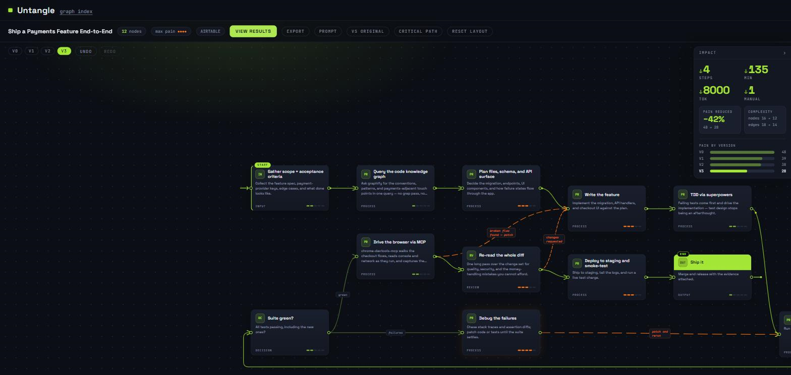

# Untangle

Map your Claude workflows. Describe a task → see the flowchart of how Claude would break it down with zero helpers → watch skills, plugins, connectors, and MCP servers from a curated knowledge base collapse it into something radically simpler → leave with the task rewritten as a prompt you can paste into Claude.

**What works today.** The `/graph-my-task` Claude Code skill generates validated `*.workflow.json` graphs, matching each step against a live Airtable knowledge base of real skills, plugins, and MCP servers; the viewer renders them as Signal graphs — dark canvas, left→right flow, pain glowing ember — and you apply the suggestions one at a time or hand the whole graph to OPTIMIZE, walk it back with UNDO, hold it against the original in a before/after wipe, and leave through one window holding the whole result: what changed, what it needs installed, and the task rewritten as a prompt beside the ask you started from. The picture above is one session, ended.

## Try the demo

**[tahirzlone.github.io/untangle](https://tahirzlone.github.io/untangle/)** — the gallery, hosted. No account, no key, nothing to install: open **Ship a Payments Feature End-to-End**, press **OPTIMIZE** and watch the flow collapse step by step, then **VS ORIGINAL** to drag the seam between where it started and where it ended, and **VIEW RESULTS** for the thing you leave with.

## Run it yourself

Node 20+ (CI runs 22). First time: `npm install` at the root **and** `npm --prefix viewer install`. The root install is not optional — the shared validator in `scripts/` resolves its `ajv` from the root `node_modules`, and it is what both the viewer and the skill's own validation loop run on, so a viewer-only install leaves a fresh clone unable to validate the graph it just generated. Then `npm run dev:viewer`, and open the printed URL. The graph index lists every graph in `gallery/`; drop any `*.workflow.json` (including files from `out/`) onto the page to open it on the canvas. Then, on the canvas:

- **Both ends are marked.** The first step wears START and takes a chevron into its left port; the last wears END and runs out of its right port to a terminal dot — so which way the work flows reads at a glance, at any zoom, and comes with the graph into an export.
- **Rest on a badged card** and its best match rises beside it — the name, what it claims, what it saves — without opening anything. Move off and it goes. Once the detail panel is open the peek stays down; the panel is already saying more than it could.
- **Click a node** for its detail panel — the whole step, unclamped, plus the resources the knowledge base matched to it. Badge pips on the cards show which steps have matches.
- **Press APPLY on a card** and watch the graph simplify: the steps it replaces collapse into one, the ember cools, what the patch saved rises off the step you pressed, and a new version lands on the version strip.
- **Read the impact panel** (right, under the toolbar) for what all of it came to: what the applied patches saved (steps, minutes, tokens, manual interventions), how much of the graph's pain is gone, the step and edge counts before and now, and a bar per version so the walk from the original reads as a shape. The chevron folds it away to a tab when you want the canvas back.
- **Press OPTIMIZE** to hand the whole graph over: the camera travels to each step worth upgrading, applies it, and moves on while the flow collapses behind it. Nothing opens over the finished graph — **VIEW RESULTS** lands in the toolbar once the run settles, and you look when you are ready. CANCEL or ESC stops the run after the patch in flight.
- **VIEW RESULTS — or PROMPT, at any version — opens the results window**, where the session pays out. It states what changed in the impact panel's own figures, lists the resources your upgrades rely on, and puts your original ask beside the prompt the session made of it — every upgrade introduced at the step that needs it, in the order the flow runs them — each pane with its own COPY. All of it is read off the version you are on, so apply, undo, or jump the strip, open it again and it answers for wherever the cursor is standing. At V0 it says nothing has been applied yet rather than dressing the task up as a result.
- **The checkboxes in that window edit the prompt.** Naming a helper does not put it on the machine, so every resource carries the exact command that does, ticked, with the command itself on screen — the string you are agreeing to run. Clear what you already have and its line leaves the optimized prompt and the paste block together, in front of you; clear the last one and the prompt still reads, asking you to install nothing. A workflow file generated before the current skill rules may also quote an install inside a step's own prose, and the checkbox governs the setup list, never a sentence the generator wrote — so on those files a cleared command can still stand in the prose above it. INSTALL KIT's COPY hands over one block: shell commands bare, Claude Code's own commented under a line saying where they are typed instead, and anything that arrived as more than one line commented under a header of its own, to read before you run it. A resource with nothing to run is listed too, as a link to its page.
- **UNDO and REDO** walk the history both ways, and any chip on the version strip jumps straight to that version — the versions ahead stay dimmed but live until you apply from an earlier one, which branches and drops them.
- **VS ORIGINAL** opens a before/after wipe: the graph you started with — arranged the way you left it — on one side of a draggable divider, the graph you have now on the other, with the headline savings floating at the seam. Drag the handle (or arrow-key it; Home/End snap it to the edges), pan and zoom from the NOW side to move both halves as one world, and leave with ESC or the button.
- **CRITICAL PATH** glows the longest run of pain through the flow. It recomputes per version, so the chain visibly shortens as you apply.
- **EXPORT** (toolbar) writes the graph as it stands to a shareable image, named for the graph and the version you are on.
- **Drag nodes** to reshape the flow; edges and return lanes follow live. **RESET LAYOUT** hands the graph back to the auto-layout engine.
- **The toolbar reads `AIRTABLE`** when a graph was generated against a knowledge base and `KB NOT LINKED` when it wasn't.

## The skill: `/graph-my-task`

Open this repo in Claude Code and run `/graph-my-task "your task here"`: the skill decomposes the task into 6–16 honest steps — the manual gathering, the format wrangling, the retry loops, the human review gates — and writes them as a validated graph in `out/`. Before it validates, it reads a curated knowledge base of real Claude skills, plugins, and MCP servers and attaches the ones that would collapse a step, each with what it claims, what it saves, and the command that installs it, when there is one. It runs on your own Claude subscription, in your own checkout, and it never invents a helper: a resource that is not in the rows it fetched does not exist for that graph.

**Suggestions need no setup.** The knowledge base resolves in four tiers, tried strictly in order, stopping at the first that hands over rows — it never climbs back up:

| Tier | When | Rows come from | What you set up |
| --- | --- | --- | --- |
| 1 | `AIRTABLE_API_KEY` is set | your own Airtable base, read live | a token, and the schema in [`kb/airtable-template.md`](kb/airtable-template.md) |
| 2 | no key set, or the key path failed | the public feed — `https://tahirlone.com/api/untangle/kb` | nothing |
| 2.5 | the feed is unreachable, non-200, or empty | [`kb/kb.json`](kb/kb.json), this repo's daily mirror of that feed | nothing — it is already on disk |
| 3 | no source returned rows | nothing: the vanilla graph, `suggestions: []` | — |

Tiers 1, 2, and 2.5 are the same table read three ways — live, mirrored, and mirrored to disk — so all three report `kbSource: "airtable"`, and every run reports the knowledge-base state in one line. Tier 3 is not a failure: the honest flowchart is the deliverable either way.

**Set the helpers up.** When the suggestions carry install commands, the skill offers to add them for real — it probes what is already on the machine, puts every exact command in a table and waits for `all` / `pick` / `none`, then runs the `claude mcp add` ones once each and prints everything else for you to run yourself. Consent is per-string and the strings are never edited, not even to rescue a failure; point the skill at any existing `*.workflow.json` and ask to install its resources to run the same stage later.

## Fork it

Fork the repo, then two gates, once each: the **Actions** tab, where GitHub parks a fresh fork's workflows until you say "I understand my workflows, go ahead and enable them", and **Settings → Pages → Build and deployment → Source: GitHub Actions**. A fork has no push of its own to publish, so start the first deploy by hand — Actions → Deploy Pages → **Run workflow** — and every push to your `main` after that republishes on its own. Your copy of the demo lives at `https://<you>.github.io/<repo>/`. Nothing here reads a secret, so CI is as green in your fork as it is in this repo, and `vite`'s relative base means the bundle loads the same at whatever path your fork's name gives it.

- **The skill runs on your own Claude subscription**, in your own Claude Code, against your own tasks.
- **`AIRTABLE_API_KEY` is optional.** Leave it unset and the suggestions come from the public feed, and from the `kb/kb.json` snapshot in the fork you just made if that feed is down. Set it and your base takes over.
- **The snapshot workflow sleeps in a quiet fork.** GitHub suspends scheduled runs on inactive forks, so `kb-snapshot.yml` stops mirroring on its own; Actions → KB snapshot → **Run workflow** revives it whenever you want a fresh one.
- **The demo redeploys on real pushes only.** A snapshot commit is pushed by the Actions bot, and a `GITHUB_TOKEN` push does not trigger workflows — which is the right outcome here: the hosted demo is the precomputed gallery, not a live read of the knowledge base.

## First publish (maintainer, once)

`configure-pages` cannot see a private repository, so a `main` push before the flip fails the deploy. The order:

1. Flip the repo public.
2. Settings → Pages → Source: **GitHub Actions**.
3. Merge `feat/launch` to `main` (or push `main`).
4. Watch the `pages.yml` run.

If the order slips, Actions → Deploy Pages → **Run workflow** re-runs it once the first two are done.

## Credits

Built by Tahir Lone — [tahirlone.com](https://tahirlone.com). The knowledge base is his own curated Airtable of Claude skills, plugins, and MCP servers, served to every keyless run through the public feed. MIT licensed; see [`LICENSE`](LICENSE).
